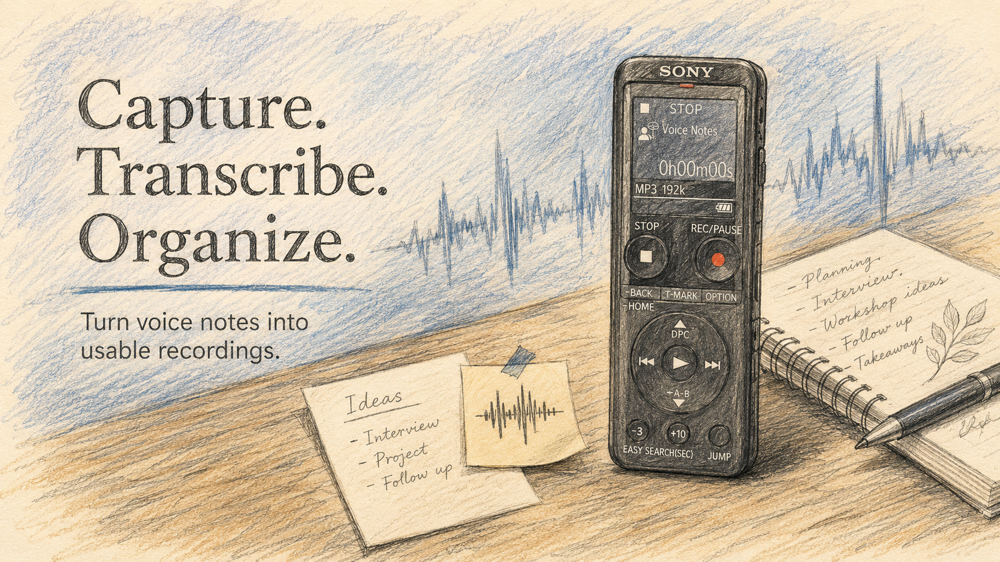

# Voice Note Organizer



**A small utility to import, organize, transcribe and visualize your recordings, using your favourite voice recorder.**

Works on macOS, Windows, and Linux. Everything runs on your machine — no
account, no upload, no subscription.

```bash
vno              # plug in the recorder — imports anything new, opens the UI
vno t            # pick recordings, transcribe them, opens the UI
vno v            # just open the UI
vno cleanup      # delete the 2-second accidental button-presses
```

That's the whole loop. Everything else is a flag or a setting — and the
[browser UI](#the-app) can do all of it too.

---

## Why this exists

**Because Sony stopped updating Sound Organizer 2.**

If you own a Sony voice recorder (like me), Sound Organizer 2 is the companion
software you're handed — and it has seen no meaningful update in a very long
time. In 2026 it still does little beyond basic import and sync. There is no
transcription, nothing to search the *contents* of a recording, no way to fix
what was written down, and no sign that any of it is coming. Meanwhile the
open-source world got good enough at speech-to-text that a recording can just
become text, locally, for free.

So the point of this project is narrow and specific: **keep using the recorder
hardware, replace the software that shipped with it.** The recorder is fine.
The desktop app is what stalled.

Built with digital record-keeping in mind — recordings land in a predictable
folder you own, transcripts are written as plain `.vtt` files next to the audio
(readable in any text editor, no database, no lock-in), and every part of it
runs on your machine.

---

## The app

`vno v` opens a two-pane organizer in your browser. **Everything the CLI can do
can be done from here**, and the page is live: edits, deletes and imports take
effect on disk immediately.


- **Takes list** — newest first, grouped by device, with a green LED where a
  transcript exists. The filter box searches names **and transcript text**, so
  you can find a recording by something said in it.
- **Follow-along transcript** — the current line highlights and scrolls as the
  audio plays. Click any line to jump straight to that moment.
- **Fix what whisper got wrong** — an in-page editor with one box per line.
  Your edits never disturb the timings.
- **Full toolbar** — import, transcribe, cleanup, open folder and settings, all
  without leaving the page. Long jobs show a progress bar and stream whisper's
  live output into a log panel.
- **Private by construction** — bound to `127.0.0.1` on a random port behind a
  single-use session token. Close the tab and the CLI exits.

📖 **[Full UI documentation →](docs/ui.md)** — every pane, dialog and keyboard
shortcut.

---

## Installation

### 1. Prerequisites

- **Node.js 18+** (or [Bun](https://bun.sh)) to run the CLI.
- **Python 3.8+ with `pip`** — needed to install Whisper (transcription).
- **ffmpeg** on your `PATH` — Whisper uses it to read audio, and `vno cleanup`
  uses `ffprobe` (shipped with ffmpeg) to measure durations.

### 2. Get the project and link it

**Not on npm yet.** It'll be published once the project settles down; until
then, clone it and link it:

```bash
git clone https://github.com/msareen/voice-notes-organizer.git
cd voice-notes-organizer

npm install          # or: bun install
npm link             # makes `vno` available from any folder
```

`npm link` symlinks the repo into your global `node_modules`, so `vno` always
runs your working copy — pull or edit the source and the next `vno` picks it
up, with no reinstall step. To undo it:

```bash
npm unlink -g @msareen/voice-notes-organizer
```

Prefer not to link? Run it in place with `node bin/vno.js <command>`, or use
the npm scripts (`npm run import`, etc.).

### 3. Install ffmpeg

| OS | Command |
| --- | --- |
| macOS | `brew install ffmpeg` |
| Windows | `winget install ffmpeg` (or `choco install ffmpeg`) |
| Linux (Debian/Ubuntu) | `sudo apt install ffmpeg` |

Verify with `ffmpeg -version` and `ffprobe -version`.

### 4. Install Whisper

> *Whisper is slow — but it is free.* Transcription runs on your own machine,
> so expect to wait; a long recording on a big model can take longer than the
> recording itself.

```bash
pip install -U openai-whisper
```

(Use `pip3` if `pip` points at Python 2.) Verify with `whisper --help`.

If Whisper isn't on your `PATH` when you run `vno transcribe`, the tool offers
to run this install for you — but ffmpeg still has to be installed separately
(step 3).

> **Windows note:** `pip` installs `whisper.exe` into your Python `Scripts`
> directory (e.g. `C:\PythonXX\Scripts`). If `whisper` isn't found after
> install, add that folder to your `PATH` and restart your shell.

---

## Commands

| Command | Aliases | What it does |
| --- | --- | --- |
| `vno` | `vno import` | Detect your recorder, import anything new, open the UI |
| `vno transcribe` | `vno t`, `vno --t` | Pick recordings and transcribe (or translate) them |
| `vno visualize` | `vno v`, `vno --v` | Open the browser UI |
| `vno cleanup` | — | Delete recordings shorter than 3 seconds, after confirming |
| `vno cleanup -f <files>` | — | Delete named recordings and their transcripts |
| `vno cleanup ledger` | — | Forget which recordings you deleted, so they import again |
| `vno setting` | `vno settings` | Interactive wizard for the common settings |
| `vno config` | — | Print the path to the config file |

A few things worth knowing up front:

- **Import remembers your devices.** The first time a volume appears you're
  asked whether to import it, and whether to pin a subfolder (for recorders
  that bury audio under `PRIVATE\SONY\VOICE\…`). After that it's silent.
  Files land **flat**, one folder per device, and re-running copies nothing
  twice.
- **Import can auto-translate.** After the first import, `vno` offers once to
  translate new notes to English as they come in, and remembers your answer.
- **Transcribe has a searchable picker.** Just start typing to filter; `Space`
  to toggle, `Ctrl+A` for all, `Enter` to go. One `.vtt` is written next to
  each audio file.
- **Nothing deletes without asking.** Only `cleanup` and the UI's delete
  buttons remove files, always behind a confirmation. Import and transcribe
  never delete anything.

📖 **[Full CLI reference →](docs/cli-reference.md)** — every flag, in detail.

---

## Configuration

Settings live in one global per-user file — `~/.vno/config.json`. Run
`vno config` to print the path.

```json
{
  "target": "/path/to/voice-notes",
  "sources": [],
  "knownMounts": {},
  "autoTranslate": null,
  "defaultModel": "turbo",
  "openWhenDone": true
}
```

| Key | What it controls |
| --- | --- |
| `target` | Where imported audio lands, and what every command scans |
| `sources` | Extra folders to import from (network shares, non-removable drives) |
| `knownMounts` | Per-device memory: auto-import, pinned subfolder, last sync |
| `autoTranslate` | Translate imports to English — `true` / `false` / `null` (ask once) |
| `defaultModel` | Whisper model: `turbo`, `tiny`, `base`, `small`, `medium`, `large` |
| `openWhenDone` | Whether finished runs launch the browser UI |

Most of these are editable from `vno setting` or the UI's Settings dialog — you
shouldn't need to touch the file.

📖 **[Full configuration reference →](docs/configuration.md)**

### Supported audio extensions

`.mp3 .wav .m4a .aac .flac .ogg .oga .wma .aiff .opus .amr .3gp`

---

## Documentation

| Page | What's in it |
| --- | --- |
| [The browser UI](docs/ui.md) | Every pane, button, dialog and keyboard shortcut |
| [CLI reference](docs/cli-reference.md) | Every command and flag, in full |
| [Configuration](docs/configuration.md) | `~/.vno/config.json`, key by key |
| [Import & sync](docs/import-and-sync.md) | Volume detection, flat imports, remembered devices |
| [Transcription](docs/transcription.md) | Whisper models, translation, the `.vtt` format |
| [Troubleshooting](docs/troubleshooting.md) | When whisper, ffmpeg, volumes or the browser misbehave |
| [Architecture](docs/architecture.md) | Source layout, the local HTTP API, working on the code |

---

## Development

```bash
npm install
npm link              # `vno` now runs your working copy from anywhere
node bin/vno.js       # or just run it directly, without linking
```

**There is no build step.** The UI's CSS and JS are read from disk on each
request, so a browser reload is enough to see an edit. See
[Architecture](docs/architecture.md) for the source layout and the ground
rules.

## License

MIT
