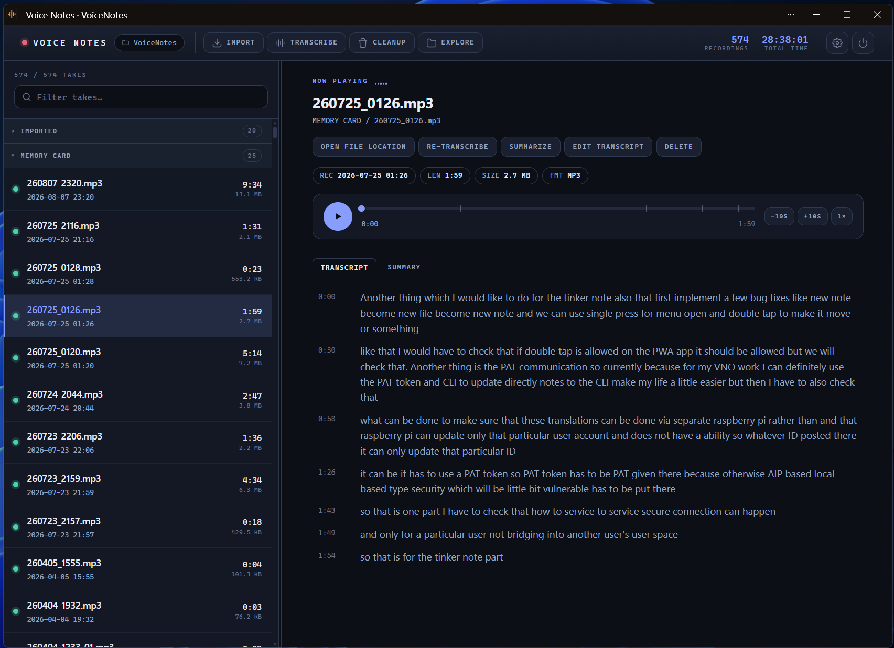

# The browser UI

`vno visualize` (alias `vno v` / `vno --v`) starts a small local web server and
opens the organizer in your browser. It is the app: **everything the CLI can
do can be done from here**, and the page is live — edits, deletes and imports
take effect on disk immediately, with no file to regenerate and nothing to
export.

It opens automatically at the end of every `vno import`, and every
`vno transcribe` that converted at least one file. Run it on its own any time
with `vno v`.

---

## Layout

### Header

| Element | What it does |
| --- | --- |
| **Root label** (`voice-notes`) | The name of your target folder |
| **Import** | Detect volumes and pull in new recordings — see [Import dialog](#import) |
| **Transcribe** | Pick takes and run whisper on them — see [Transcribe dialog](#transcribe) |
| **Cleanup** | Find and delete very short recordings — see [Cleanup dialog](#cleanup) |
| **Explore** | Opens the target folder in Explorer / Finder / your file manager — the same thing `vno explore` does |
| **Settings** | The four settings also offered by `vno setting` — see [Settings dialog](#settings) |
| **Takes / Total** | Number of recordings and their combined running time |
| **Quit** | Stops the server and ends the CLI session |

While a job is running, a progress bar and a **Log** toggle appear in the
header, and the command buttons are disabled until it finishes.

### Left pane — the takes list

Newest recording first. Each row shows the file name, the recorded date and
time, the duration, the file size, and a **green LED** when a transcript
exists.

- **Grouping** — rows group by device folder. Each group header collapses with
  a click, and carries a `⧉` button that opens that folder on disk.
- **Filter box** — searches file names *and* transcript text, so you can find a
  recording by something said in it. The `n / n takes` counter above the box
  tracks the filtered count.
- **Keyboard** — `↑` / `↓` move through the visible list; `Enter` or `Space`
  selects the focused row.
- **Divider** — drag it to resize the pane. It's focusable too: `←` / `→`
  resize in steps once it has focus.

### Right pane — the playback deck

- **Now playing** header with the file name and its folder path.
- **Metadata chips**: `REC` (recorded date/time), `LEN` (duration), `SIZE`,
  `FMT` (container).
- **Audio player** — a plain HTML5 player. Audio is streamed from disk with
  range requests, so seeking works and nothing is copied anywhere.
- **Transcript** — a timed `.vtt` follows along as it plays: the current line
  is highlighted and scrolled into view, and clicking any line jumps playback
  to that timestamp. A plain `.txt` is shown as a block, without highlighting.

### Per-take actions

| Button | What it does |
| --- | --- |
| **Open file location** | Opens the file's containing folder in Explorer / Finder |
| **Transcribe** / **Re-transcribe** | Opens the transcribe dialog for just this take |
| **Edit transcript** | Opens the in-page editor (below) |
| **Delete** | Deletes the audio *and* its transcript sidecars, after a confirmation |

---

## Transcript editor

A deliberately minimal in-page editor, reached with **Edit transcript**.

- **Timed transcripts** (`.vtt`, `.srt`) get **one text box per cue**, with the
  timestamp shown beside it. Only the text is editable, so **your edits never
  disturb the timings** — the original timings are read back off disk on save
  and written out unchanged.
- **Untimed notes** get a single text box. A note with **no transcript at all**
  can have one typed by hand this way; clearing the box removes the sidecar.
- **`Ctrl`/`Cmd`+`Enter`** saves. **`Esc`** cancels.

If the file changed on disk while you were editing (a re-transcribe finished,
say), the save is refused with *"Transcript changed on disk — reload and try
again"* rather than overwriting the new version.

---

## Dialogs

### Import

Lists every detected volume plus every folder configured in
[`sources`](configuration.md#sources). For each one:

- A **checkbox** — pre-checked for configured sources and for volumes you've
  already chosen to auto-import.
- The **mount path**, and the date it was last synced.
- A **Subfolder** button that walks the volume's folder tree one level at a
  time, so a recorder that buries audio under `PRIVATE/SONY/…` can be pinned
  without typing a path. *Reset to whole volume* undoes it.

Two checkboxes apply to the run: **translate newly imported notes to English**
(pre-set from your `autoTranslate` setting) and **remember these volumes and
auto-import them next time** (on by default).

If nothing is connected, the dialog says so and points at the `sources` config
option.

### Transcribe

Lists every take with a `has transcript` / `no transcript` marker. Untranscribed
ones are checked by default; when there's no backlog left, everything is. Use
**All** / **None** to toggle the list in bulk.

Below the list: the **whisper model** (defaulting to your
[`defaultModel`](configuration.md#defaultmodel)) and a **translate to English**
checkbox. **Start** kicks off the job.

If whisper.cpp or ffmpeg isn't installed, the dialog says so up front. A web
page can't run an installer, so it points you at `vno setup` in a terminal,
which offers to install what's missing. Starting the job anyway is refused with
the same message.

### Cleanup

Enter a **threshold in seconds** (default 3) and scan. The dialog lists every
recording shorter than that with its duration, checkboxes to deselect any you
want to keep, and a confirmation before deleting. Matching `.vtt` / `.srt` /
`.txt` sidecars go with them.

### Settings

The settings that are also offered by `vno setting`:
[`autoTranslate`](configuration.md#autotranslate) (on / off / ask each time),
[`defaultModel`](configuration.md#defaultmodel),
[`transcribeLanguage`](configuration.md#transcribelanguage),
[GPU acceleration](configuration.md#accel),
[`openWhenDone`](configuration.md#openwhendone), and
[`rememberDeletions`](configuration.md#rememberdeletions). The **target folder**
is shown but not editable here — changing it needs a re-scan, so it lives in
`vno setting`. Changes save as you make them.

The GPU row only appears when an accelerator-capable whisper.cpp build was
installed, and only turns it on or off: *installing* one is
[`vno setup`](cli-reference.md#vno-setup)'s job, since the browser can't run
an installer. Until you've run it, the dialog says so. A transcribe job logs
which device it used.

Deletes made from this page — both the per-take **Delete** and **Cleanup** —
are recorded, so importing again won't copy those recordings back off the
device. Clearing that record is a CLI job: `vno cleanup ledger`.

`Esc` closes any dialog. When dialogs stack (the subfolder browser over the
import dialog), `Esc` closes only the topmost one.

---

## Jobs and the log

Import and transcription run as **jobs**. At most one runs at a time — starting
a second is refused with a *"Busy"* message.

While one runs, the header shows a progress bar and a per-file title
(*"Transcribing 260725_0126.mp3 (2/7)"*). The **Log** panel streams whisper's
live output, including its progress bar, so a long transcription isn't a black
box. The last 200 lines are kept.

Failures on individual files are logged and the job carries on with the rest —
one unreadable recording doesn't abandon the batch.

---

## Lifecycle: how the session ends

The CLI stays up serving the page, and exits when you're done with it:

- **Quit** in the header stops the server immediately.
- **Closing the browser tab does the same** — the CLI exits a few seconds
  later. A page *reload* isn't mistaken for a close, and a second tab keeps the
  session alive.
- A job already running is **allowed to finish** before shutdown, so you never
  get a half-written transcript.
- A wedged connection (sleeping laptop, proxy) is caught by a watchdog after
  two minutes of silence.

---

## Security model

These endpoints delete files and launch programs, so access is narrow by
design:

- The server binds to **`127.0.0.1`** on a **random free port** — never an
  external interface.
- Every request needs a **single-use session token**, generated per run and
  inlined into the page. Requests without it get a 403, including anyone who
  guesses the port.
- **Cross-origin requests are refused** outright, so a page in another tab
  can't drive your session.
- Every file path is resolved back against the target folder; anything
  escaping it is rejected.

`-p/--port <number>` pins the port if you need a stable one; `--no-open` starts
the server without launching a browser (it prints the tokenized URL instead).

> Earlier versions wrote a static `index.html` into the target folder. That
> file is no longer generated or updated — if you have one lying around it's a
> stale snapshot and can be deleted.

---

[← Back to the docs index](README.md) · [CLI reference](cli-reference.md) · [Configuration](configuration.md)
